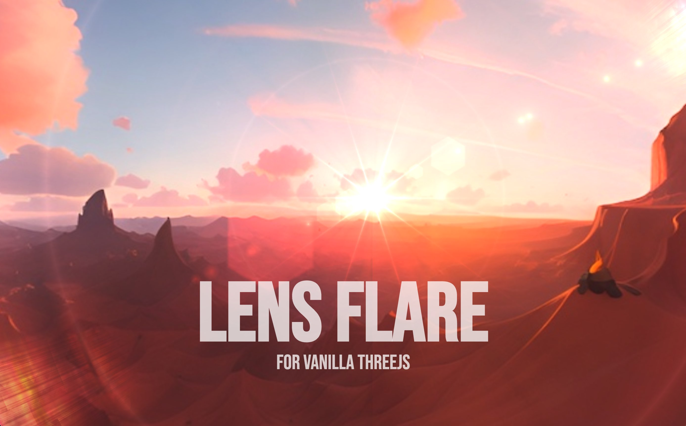

# Lens Flare for Vanilla Threejs

<h4>by Anderson Mancini</h4>

Lens Flare adds the optical aberration caused by the dispersion of light entering the lens through its edges. This ons don't use any post-processing pipeline and it is very easy to use and customize.

<p align="center">
    
</p>

# HOW TO USE?

#### 1. Download the files component and save it on your project

[Download the Lens Flare source code](https://gist.githubusercontent.com/ektogamat/23e31dc891bb2859cbe0e89b46e288de/raw/0dc29630f7d841920b2ddb671c34215a052062f0/LensFlare.js) and save into your project

#### 2. Import the component

```js
import LensFlare from './LensFlare'
```

Then add the LensFlare to your Scene

```js
const lensFlareEffect = LensFlareEffect()
scene.add(lensFlareEffect)
```

That's all you need ✨

---

### Ignoring occlusion on some objects

To disable the occlusion effect, simply add `userData={{ lensflare: 'no-occlusion' }}` to your object/mesh. This feature is particularly useful for creating realistic skyboxes in demos. By utilizing this setting, the internal raycaster of Lens Flare will exclude the designated object/mesh from occlusion calculations.

### Debud interface

You can add this to your project to have a debug interface to change the parameters.

```js
import * as dat from 'lil-gui'
```

```js
// Debug Lens Flare
const gui = new dat.GUI()
gui.add(lensFlareEffect.material.uniforms.enabled, 'value').name('Enabled?')
gui.add(lensFlareEffect.material.uniforms.followMouse, 'value').name('Follow Mouse?')
gui.add(lensFlareEffect.material.uniforms.starPoints, 'value').name('starPoints').min(0).max(9)
gui.add(lensFlareEffect.material.uniforms.glareSize, 'value').name('glareSize').min(0).max(2)
gui.add(lensFlareEffect.material.uniforms.flareSize, 'value').name('flareSize').min(0).max(0.1).step(0.001)
gui.add(lensFlareEffect.material.uniforms.flareSpeed, 'value').name('flareSpeed').min(0).max(1).step(0.01)
gui.add(lensFlareEffect.material.uniforms.flareShape, 'value').name('flareShape').min(0).max(2).step(0.01)
gui.add(lensFlareEffect.material.uniforms.haloScale, 'value').name('haloScale').min(-0.5).max(1).step(0.01)
gui.add(LensFlareParams, 'opacity').name('opacity').min(0).max(1).step(0.01)
gui.add(lensFlareEffect.material.uniforms.ghostScale, 'value').name('ghostScale').min(0).max(2).step(0.01)
gui.add(lensFlareEffect.material.uniforms.animated, 'value').name('animated')
gui.add(lensFlareEffect.material.uniforms.anamorphic, 'value').name('anamorphic')
gui.add(lensFlareEffect.material.uniforms.secondaryGhosts, 'value').name('secondaryGhosts')
gui.add(lensFlareEffect.material.uniforms.starBurst, 'value').name('starBurst')
gui.add(lensFlareEffect.material.uniforms.aditionalStreaks, 'value').name('aditionalStreaks')
gui.close()
```

### Improving performance

⚠️ The `StarBurst` option is very intense for some GPU's to compute. If you have any issues with the performance, you can disable it.

### Compatibility

`Lens Flare` is compatible with all modern browsers that support WebGL 2.0 (WebGL 1 is not supported), using three.js version r153 or later is recommended.

### Getting Started using this demo project

Download and install Node.js on your computer (https://nodejs.org/en/download/).

Then, open VSCODE, drag the project folder to it. Open VSCODE terminal and install dependencies (you need to do this only in the first time)

```shell
npm install
```

Run this command in your terminal to open a local server at localhost:3000

```shell
npm run dev
```

### License

A CC0 license is used for this project. You can do whatever you want with it, no attribution is required. However, if you do use it, I'd love to hear about it!

### Can you leave a star please?

I genuinely appreciate your support! If you're willing to show your appreciation, you can <strong>give me a star on GitHub 🎉 </strong>or consider buying a coffee to support my development at https://www.buymeacoffee.com/andersonmancini. The funds received will be utilized to create more valuable content about Three.js and invest in acquiring new courses. Thank you for your consideration!

### Credits

Hard to remember everything I read to achieve this, but here's a list of resources that have been helpful to me:

- https://www.shadertoy.com/view/4sK3W3
- https://www.shadertoy.com/view/4sX3Rs
- https://www.shadertoy.com/view/dllSRX
- https://www.shadertoy.com/view/Xlc3D2
- https://www.shadertoy.com/view/XtKfRV
- https://blog.maximeheckel.com/posts/the-study-of-shaders-with-react-three-fiber/
- https://skybox.blockadelabs.com/
